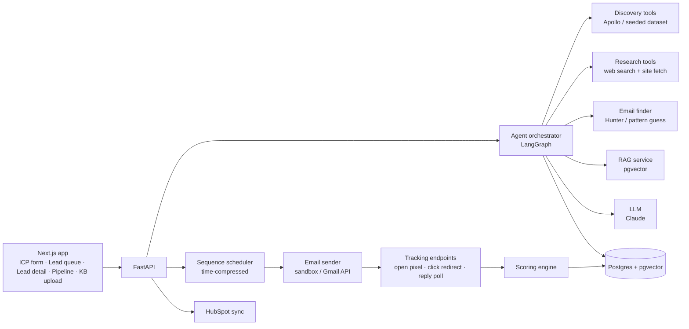

# District 02 — Solution Architecture & Technical Plan

Working name: **TBD** (pick with the repo name).

## 1. The one loop the product is built around

```
Define ICP ─► Discover companies ─► Find decision-makers ─► Research ─► Qualify + score
                                                                          │
      ┌───────────────────────────────────────────────────────────────────┘
      ▼
Draft personalized email (RAG proof points) ─► Rep approves ─► 3-step sequence runs
      ▲                                                             │
      └──── score updates on every engagement event ◄───────────────┘
                         │
                         ▼
          Priority queue + pipeline dashboard + HubSpot sync
```

Every component below exists to make this loop work and be visible in a demo.

## 2. System components



### 2.1 Agent orchestrator (agentic workflows)

One LangGraph graph per lead batch. Nodes:

| Node | Does | Tools | Output |
|---|---|---|---|
| `derive_icp` (optional) | Proposes ICP from seller KB | RAG | ICP JSON (industries, size, geo, personas, pains, disqualifiers) |
| `discover` | Finds matching companies | discovery provider | company list |
| `find_people` | Picks 1–3 personas per company | people search, email finder | contacts |
| `research` | Builds a company + person brief | web search, page fetch | brief with cited sources, trigger events |
| `qualify` | Scores fit criterion-by-criterion vs ICP | RAG (ICP + disqualifiers) | fit score, rationale, verdict |
| `draft` | Writes step-1 email | RAG (case studies, value props) | subject, body, cited proof points |
| `human_review` | **Interrupt** until rep approves/edits | — | approved draft |
| `enqueue_sequence` | Schedules 3 steps | scheduler | sequence record |

Why LangGraph: native checkpointing and `interrupt` for human-in-the-loop, conditional edges for disqualify/retry, and the run trace can be rendered in the UI. Plain Python with a state enum is an acceptable fallback if the team doesn't know LangGraph; don't learn a framework under deadline if nobody has used it.

Every tool call is written to an `agent_events` table (lead, node, tool, input summary, output summary, latency, tokens). That table *is* the audit log and the "watch the agent work" UI.

### 2.2 RAG knowledge base

- **Content:** seller's product/service pages, case studies, pricing, objection-handling notes, ICP notes. For the demo, use Spazor Labs' own public pages as the seller KB.
- **Pipeline:** upload (PDF/MD/URL) → chunk (~500 tokens, overlap) → embed → `kb_chunks` in pgvector with metadata (doc, section, type = case_study / value_prop / objection / pricing).
- **Embeddings:** Anthropic has no embedding endpoint. Options: Voyage AI (hosted, simple) or a local `bge-small` / `e5` via sentence-transformers (free, no key). Pick one on day 0.
- **Where it changes outputs (this is the point):**
  1. `derive_icp` — ICP drafted from the seller's own material.
  2. `qualify` — disqualifiers and fit criteria pulled from KB.
  3. `draft` — retrieve the case study most similar to the prospect's industry/pain; email cites it; UI shows which chunk was used.
  4. (stretch) reply handling — objection → retrieved rebuttal.

### 2.3 Data sources (the real risk)

| Need | Primary | Fallback | Notes |
|---|---|---|---|
| Company discovery | Apollo.io API | Seeded CSV of ~100 real companies matching the demo ICP | Verify free-plan API access on day 0; plans change. |
| People / titles | Apollo people search | LLM extracts leadership from company "About/Team" pages | Never scrape LinkedIn. Store LinkedIn URLs only if the provider returns them. |
| Emails | Hunter.io (free tier, small quota) | Pattern guess (first.last@domain) flagged "unverified" | Demo-scale only. |
| Research | Tavily / Exa / Serper search API + fetch of company site | Cached research JSON for demo leads | Cap ~5 pages per lead. |
| Intent signals (P2) | News search, careers page, funding mentions | — | Feed into intent score. |

Wrap each behind a `Provider` interface so the seeded fallback is a one-line switch. This also makes the "agency could swap in a client's data source" story true.

### 2.4 Scoring model (opportunity / conversion score)

Transparent and configurable, not a black box:

```
priority = w_fit·Fit + w_intent·Intent + w_eng·Engagement      (defaults 0.45 / 0.25 / 0.30)
```

- **Fit (0–100):** LLM rates each ICP criterion (industry, size, geo, persona seniority, pain match) 0–5 with one-line evidence; weighted sum. Disqualifier hit caps Fit at 20.
- **Intent (0–100):** trigger events from research (hiring for relevant roles, funding, new product, tech change), recency-decayed.
- **Engagement (0–100):** opens (low weight, unreliable), clicks, replies (sentiment-classified), with time decay.
- Score recomputed on every event; the UI shows the breakdown and *what changed*.
- **Honest framing for judges:** there is no outcome data to train on, so this is a rules + LLM-feature model designed so weights can later be fitted (logistic regression) once won/lost data accumulates in the CRM. Do not present synthetic-data ML as "AI scoring".

### 2.5 Three-step sequence engine

- `sequences` (lead, template, status) and `sequence_steps` (step_no, scheduled_at, status, draft, sent_at).
- Default cadence: Day 0 intro → Day 3 value-add (different proof point) → Day 7 short breakup. Configurable per campaign.
- Steps 2 and 3 are generated at send time with prior steps + any new research in context, so they don't repeat.
- Stop conditions: reply, unsubscribe, bounce, manual stop, stage moved to Meeting.
- **Time compression:** `TIME_SCALE` env var (e.g., 1 day = 60 s) so the whole sequence plays out live in the demo.
- Scheduler: APScheduler or a simple polling worker over `sequence_steps`. No Celery/Redis needed at this scale.

### 2.6 Email sending & tracking

- **Send only to team-owned inboxes.** Options: Gmail API on a test account (also lets us read replies), or Resend/Mailtrap sandbox.
- Opens: 1×1 pixel endpoint. Clicks: redirect endpoint. Both write `engagement_events`.
- Replies: poll the Gmail test inbox; plus a "simulate reply" control in the UI as demo insurance (clearly labelled).
- Unsubscribe link + suppression table, enforced before every send.

### 2.7 CRM integration

- **HubSpot free CRM**, private-app access token. Map: company → Company, contact → Contact, qualified lead → Deal in a pipeline whose stages mirror our lifecycle.
- Push on qualification; push stage changes; write an engagement note with the email body.
- One CRM only. Design a `CRMAdapter` interface so Salesforce/Zoho is a credible "next" on a slide.

### 2.8 Dashboard

- **Priority queue** (home screen): top leads by score, score delta, recommended next action, one-click approve.
- **Lead detail:** research brief with sources, qualification rationale, score breakdown, email thread, agent trace.
- **Pipeline:** kanban by lifecycle stage.
- **Analytics:** funnel counts, reply rate by step, avg time from discovery to first touch, **estimated rep hours saved** (leads processed × minutes a rep would spend researching + writing; state the assumption).

## 3. Data model (core tables)

`workspaces` · `icps` · `companies` · `contacts` · `leads` (contact × campaign, stage, scores) · `research_briefs` · `qualifications` · `kb_documents` · `kb_chunks` (vector) · `sequences` · `sequence_steps` · `engagement_events` · `agent_events` · `suppression_list` · `crm_sync_log`

## 4. Tech stack

| Layer | Recommendation | Alternative | Why |
|---|---|---|---|
| Frontend | Next.js + Tailwind + shadcn/ui | Vite + React | Fast, good components for tables/kanban. |
| Backend | FastAPI (Python) | Next.js API routes (TS end to end) | Python has the best agent/RAG tooling. |
| Agents | LangGraph | Plain Python state machine | HITL interrupts + trace for free. |
| LLM | Claude (`claude-sonnet-5-5` for agent reasoning/drafting, `claude-haiku-4-5-20251001` for bulk extraction/classification) | Whatever credits organisers provide | Check credits and rate limits first. |
| DB + vectors | Postgres + pgvector (Supabase) | SQLite + Chroma | One database for relational + vectors; Supabase also gives auth. |
| Embeddings | Voyage AI or local bge-small | — | See 2.2. |
| Search | Tavily or Exa | Serper | Built for agent research. |
| Email | Gmail API (test inbox) | Resend / Mailtrap | Gmail also gives reply detection. |
| CRM | HubSpot free | — | Real API, free, quick token setup. |
| Deploy | Vercel (web) + Render/Railway (API) | Docker compose locally | A live URL helps judging. |

Decision to make on day 0: **Python backend vs TypeScript end to end.** Recommendation is Python unless most of the team is TS-only.

## 5. Responsible-AI features (cheap, high-signal for this sponsor)

- Approval gate before send; auto-send only above a configurable score threshold.
- Every score/verdict has a rationale and sources.
- Agent action log per lead.
- Suppression list and unsubscribe enforced in code, not just in the template.
- Prompt guard: research content is treated as data (prospect websites can contain prompt injection).
- PII minimisation: store only fields used; delete-lead purges everything.
